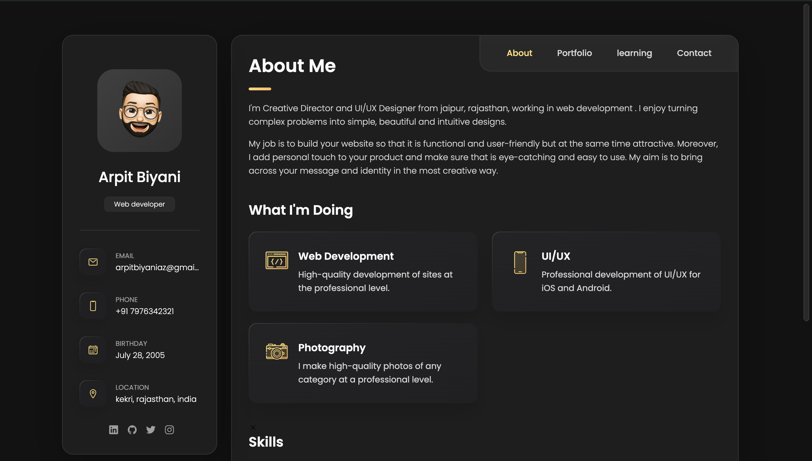
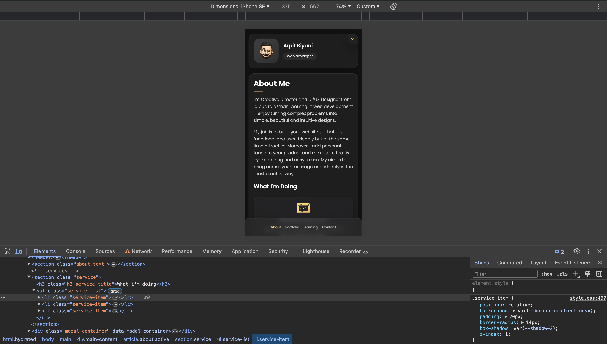

# PROJECT-PORTFOLIO

It is a fully responsive personal portfolio website, responsive for all devices, built using HTML, CSS, and JavaScript.
for more reference you may go to website demo image folder > [demo video](./website-demo-image/demo-video.mp4)

## Demo

## Prerequisites

Before you begin, ensure you have met the following requirements:

* [Git](https://git-scm.com/downloads "Download Git") must be installed on your operating system.
